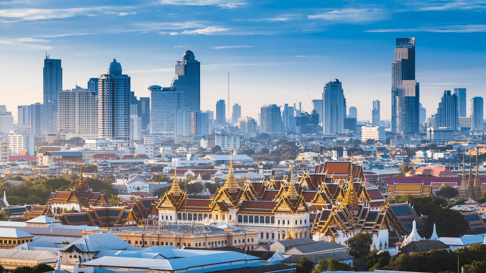

# Bangkok Travel Vlog Website

A responsive, multi-page static travel website that introduces Bangkok through destination cards, detail pages, and a compact city guide.

> **Türkçe özet:** Bangkok'u tanıtan, turistik noktalar ve detay sayfaları içeren çok sayfalı statik web sitesi tasarımıdır.



## Highlights

- Three main pages: home, city guide, and places to visit
- Six destination cards with expandable summaries and individual detail pages
- Responsive layout for smaller screens
- Native JavaScript interaction with no runtime dependency
- Real project images are kept in the repository

## Run locally

No build step is required. Open `Index.html` in a modern browser, or serve this directory with a static web server.

## Project structure

```text
Index.html       Landing page
About.html       Bangkok city guide
Places.html      Destination cards
Places/          Six individual destination pages
Images/          Project visuals
Site.css         Shared styles and responsive rules
```

## Notes

The site is an academic static web design project. Personal contact details and unused browser-saved page artifacts are intentionally excluded from the portfolio version.
